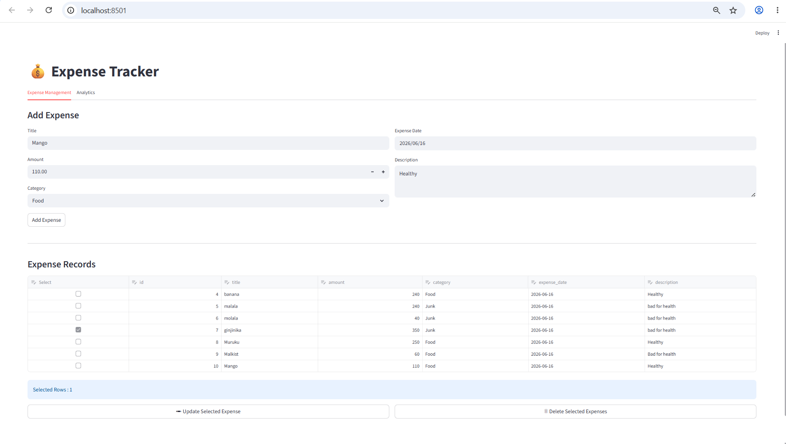
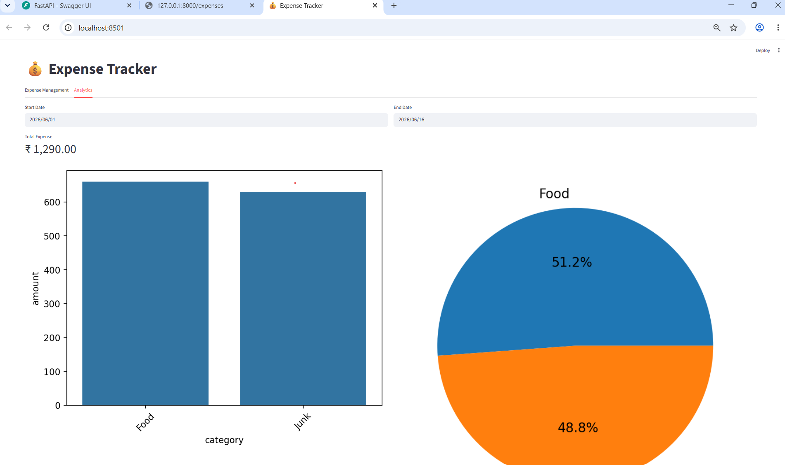
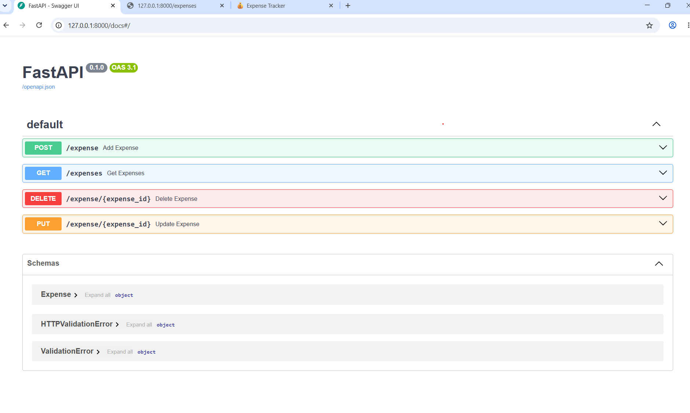

# 💰 Expense Tracker

A full-stack Expense Tracker application built using:

- Streamlit (Frontend)
- FastAPI (Backend)
- MySQL (Database)
- Pandas (Data Analysis)
- Matplotlib & Seaborn (Visualizations)

This project demonstrates end-to-end CRUD operations, REST API development, database integration, analytics dashboards, and data visualization.

---

# 📌 Features

## Expense Management

- Add Expense
- View Expenses
- Update Expense
- Delete Single / Multiple Expenses
- Category Selection
- Expense Description
- Expense Date Tracking

## Analytics Dashboard

- Total Expense Summary
- Category-wise Expense Analysis
- Expense Distribution Pie Chart
- Daily Expense Trend
- Date Range Filtering

## Backend APIs

- Create Expense
- Read Expenses
- Update Expense
- Delete Expense

---

# 🏗 Architecture

```text
                +------------------+
                |    Streamlit     |
                |    Frontend UI   |
                +--------+---------+
                         |
                         |
                         v
                +------------------+
                |     FastAPI      |
                |   REST APIs      |
                +--------+---------+
                         |
                         |
                         v
                +------------------+
                |      MySQL       |
                |     Database     |
                +------------------+
```

---

# 📂 Project Structure

```text
ExpenseTracker/
│
├── backend/
│   ├── db.py
│   └── main.py
│
├── frontend/
│   └── app.py
│
├── images_ui/
│   ├── ExpenseManagement_tab.png
│   ├── AnalyticsTracker_tab.png
│   └── FastAPI_docs_test_endpoint.png
│
├── .env
├── .gitignore
├── requirements.txt
└── README.md
```

---

# ⚙️ Technologies Used

| Component | Technology |
|------------|------------|
| Frontend | Streamlit |
| Backend | FastAPI |
| Database | MySQL |
| Data Processing | Pandas |
| Visualization | Matplotlib |
| Visualization | Seaborn |
| API Testing | Swagger UI |
| Version Control | Git & GitHub |

---

# 🗄 Database Schema

## Expenses Table

```sql
CREATE TABLE expenses (
    id INT AUTO_INCREMENT PRIMARY KEY,
    title VARCHAR(255),
    amount DECIMAL(10,2),
    category VARCHAR(100),
    expense_date DATE,
    description TEXT
);
```

---

# 🚀 Installation

## Clone Repository

```bash
git clone git@github.com:abhinav29890/ExpenseTracker.git

cd ExpenseTracker
```

---

## Create Virtual Environment

### Windows

```bash
python -m venv venv
```

Activate:

```bash
venv\Scripts\activate
```

---

## Install Dependencies

```bash
pip install -r requirements.txt
```

---

# 🔐 Environment Variables

Create a `.env` file:

```env
DB_HOST=localhost
DB_USER=root
DB_PASSWORD=your_password
DB_NAME=expense_tracker
```

---

# ▶️ Running the Application

## Start FastAPI Backend

Navigate to backend folder:

```bash
cd backend
```

Run:

```bash
uvicorn main:app --reload
```

Backend URL:

```text
http://localhost:8000
```

Swagger Documentation:

```text
http://localhost:8000/docs
```

---

## Start Streamlit Frontend

Navigate to frontend folder:

```bash
cd frontend
```

Run:

```bash
streamlit run app.py
```

Frontend URL:

```text
http://localhost:8501
```

---

# 📸 Application Screenshots

## Expense Management Dashboard



---

## Analytics Dashboard



---

## FastAPI Swagger Documentation



---

# 📊 Analytics Available

The dashboard currently provides:

- Total Expense Tracking
- Category-wise Expense Analysis
- Expense Distribution Pie Chart
- Daily Expense Trends
- Date Range Filters

---

# 🧪 API Endpoints

| Method | Endpoint | Description |
|----------|----------|-------------|
| POST | /expense | Create Expense |
| GET | /expenses | Get All Expenses |
| PUT | /expense/{id} | Update Expense |
| DELETE | /expense/{id} | Delete Expense |

---

# 🔒 Git Ignore

Ignored files:

```text
venv/
.env
__pycache__/
.vscode/
```

---

# 🔮 Future Enhancements

- User Authentication
- JWT Authorization
- Monthly Expense Reports
- Export to Excel
- Export to PDF
- Expense Budget Tracking
- Docker Support
- SQLAlchemy ORM Integration
- Cloud Deployment

---

# 👨‍💻 Author

Abhinav

GitHub:
https://github.com/abhinav29890

---

# ⭐ Learning Outcomes

This project demonstrates:

- Python Backend Development
- REST API Design
- FastAPI
- Streamlit UI Development
- MySQL Integration
- CRUD Operations
- Data Analytics
- Data Visualization
- Git & GitHub Workflow
